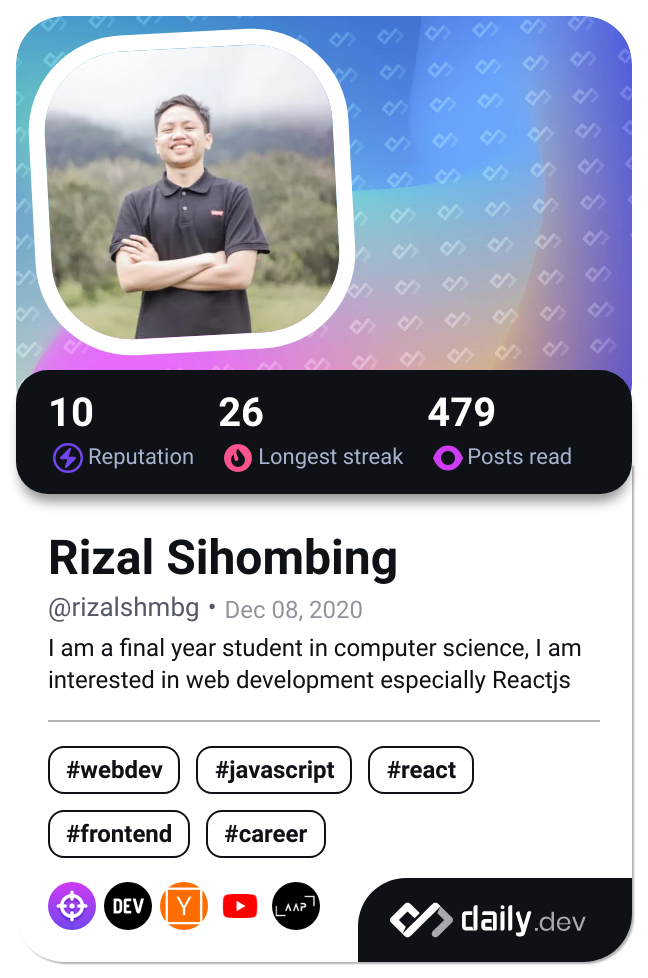

<!--
**rizalshmbg/rizalshmbg** is a ✨ _special_ ✨ repository because its `README.md` (this file) appears on your GitHub profile.

Here are some ideas to get you started:

- 🔭 I’m currently working on ...
- 🌱 I’m currently learning ...
- 👯 I’m looking to collaborate on ...
- 🤔 I’m looking for help with ...
- 💬 Ask me about ...
- 📫 How to reach me: ...
- 😄 Pronouns: ...
- ⚡ Fun fact: ...
- [](https://github.com/rizalshmbg/rizalshmbg)
-->

<!-- <a href="https://app.daily.dev/rizalshmbg"></a> -->

<!--  -->

<!-- <p align="center"><a href="https://app.daily.dev/rizalshmbg"></a></p> -->

<h1 align="center">I'm Rizal Sihombing 👋</h1>
<h3 align="center">Junior Full Stack Web Developer</h3>

<p align="center">  </p>

<p align="center">🌱 I’m currently learning <strong>Java Spring Boot</strong></p>

<p align="center">👯 I’m looking to collaborate on <strong>open-source projects related to React, Express, and JavaScript.</strong></p>

<p align="center">💬 Ask me about <strong>Web Dev</strong></p>

<p align="center">📫 How to reach me <a href="mailto:sihombingrizal18@gmail.com"><strong>sihombingrizal18@gmail.com</strong></a></p>

<p align="center">😅 Fun fact <strong>The first time I started programming was not "Hello World!"</strong></p>


<h3 align="center">Connect with me:</h3>
<p align="center">
<a href="https://dev.to/rizalshmbg" target="blank"></a>
<a href="https://twitter.com/rizal_shmbg" target="blank"></a>
<a href="https://linkedin.com/in/rizal-sihombing-b069061b8" target="blank"></a>
<a href="https://stackoverflow.com/users/14569686/rizal-sihombing" target="blank"></a>
<a href="https://fb.com/rizal.shmbg" target="blank"></a>
<a href="https://instagram.com/rizal.shmbg" target="blank"></a>
<a href="https://medium.com/@sihombingrizal18" target="blank"></a>
<a href="https://www.hackerrank.com/rizalshmbg" target="blank"></a>
<a href="https://discord.gg/Rizal Sihombing#8730" target="blank"></a>
</p>

<h3 align="center">Languages and Tools:</h3>
<p align="center"> <a href="https://getbootstrap.com" target="_blank" rel="noreferrer">  </a> <a href="https://www.w3schools.com/css/" target="_blank" rel="noreferrer">  </a> <a href="https://firebase.google.com/" target="_blank" rel="noreferrer">  </a> <a href="https://git-scm.com/" target="_blank" rel="noreferrer">  </a> <a href="https://www.w3.org/html/" target="_blank" rel="noreferrer">  </a> <a href="https://developer.mozilla.org/en-US/docs/Web/JavaScript" target="_blank" rel="noreferrer">  </a> <a href="https://reactjs.org/" target="_blank" rel="noreferrer">  </a> <a href="https://redux.js.org" target="_blank" rel="noreferrer">  </a> <a href="https://sass-lang.com" target="_blank" rel="noreferrer">  </a> <a href="https://tailwindcss.com/" target="_blank" rel="noreferrer">  </a> </p>

<p align="center">
<a href="https://github.com/rizalshmbg">
  
  
</a>
</p>

<!--START_SECTION:waka-->

```txt
Java              6 hrs 37 mins   ███████████████░░░░░░░░░░   59.75 %
TypeScript        2 hrs 13 mins   █████░░░░░░░░░░░░░░░░░░░░   20.15 %
JavaScript        1 hr 6 mins     ██▒░░░░░░░░░░░░░░░░░░░░░░   09.97 %
Java Properties   27 mins         █░░░░░░░░░░░░░░░░░░░░░░░░   04.07 %
Groovy            26 mins         █░░░░░░░░░░░░░░░░░░░░░░░░   03.91 %
```

<!--END_SECTION:waka-->


